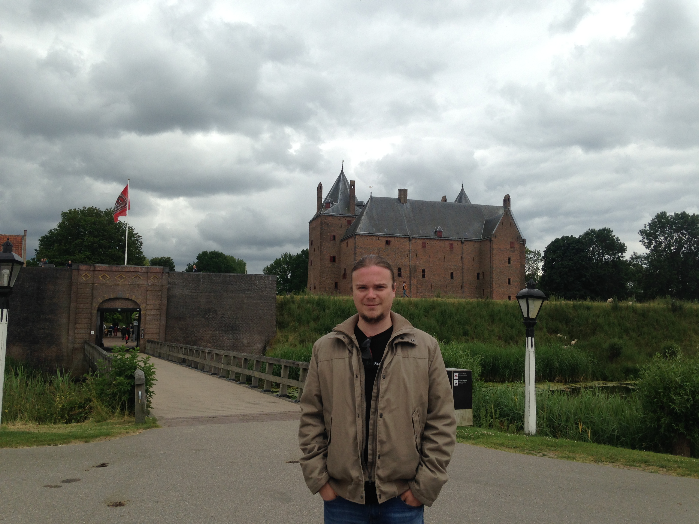

<html>
<head>
  <title>dr. Alexandru Uta, Faculty of Sciences, Vrije Universiteit Amsterdam</title>
  <link href="theme_vu.css" type="text/css" rel="StyleSheet">

</head>
<body>

<table width="680" cellspacing="0" cellpadding="10" summary="">
<tr>
<td>
	<table>
	<tr>
  <td>
	 
  </td>
  <td>
     
  	<h1>Alexandru Uta</h1>
  </td>
  </tr>
  </table>
  

</td>
</tr>
<tr>
<table>
<tr>
<td>
<a href="#info">Info</a>
</td>
<td>
<a href="#grants">Grants</a>
</td>
<td>
<a href="#awards">Awards</a>
</td>
<td>
<a href="#service">Service</a>
</td>
<td>
<a href="#education">Education</a>
</td>
<td>
<a href="#publications">Publications</a>
</td>
</tr>
</table>
</tr>
<tr>
<td>

<!--------------------------------------------------------------------->

<table>

<tr>
<td>  </td>
<td> 
dr. Alexandru Uta 
LIACS, Leiden University 
Snellius building 
Niels Bohrweg 1  
2333 CA Leiden 
The Netherlands  
 
Email: Initial.Lastname@vu.nl  
 
Room no.: 138
 
 

<a href="https://scholar.google.nl/citations?user=GbhFWcoAAAAJ&hl=en">Google Scholar</a>
</td>
 

 </tr></table>

 

<h2 id="info">General Information</h2>

I am an assistant professor at <a href="https://liacs.leidenuniv.nl">LIACS, Leiden University</a>, working in the Computer Systems group led by prof.dr. Harry Wijshoff.

 I work on distributed systems infrastructure: from designing reproducible experiments, to understanding and evaluating performance, as well on designing efficient infrastructure. My lines of work are: 1. reproducible performance evaluation for large-scale distributed computer systems; 2. resource management of serverless, FaaS and microservice platforms; 3. efficient infrastructure for big data processing frameworks; 4. converged infrastructure for HPC, big data and ML platforms.

Previously, I was a postdoctoral researcher in the <a href="http://www.cs.vu.nl/en/research/computer-systems/index.aspx">Computer Systems
Section</a> at the Department of Computer Science of the Vrije Universiteit Amsterdam. Currently, I am a guest researcher in the 
<a href="https://atlarge-research.com">Massivizing Computer Systems</>a Group, led by prof.dr.ir. <a href="http://www.ds.ewi.tudelft.nl/~iosup/">Alexandru Iosup</a>. 

 In the summer of 2019, I was a research visitor in the <a href="https://www.flux.utah.edu">Flux Research Group</a> at the <a href="https://www.utah.edu">University of Utah</a>, working closely with <a href="https://ricci.io">dr. Robert Ricci</a>.

In the summer of 2017, I worked as a research-intern at <a href="https://databricks.com">Databricks</a>, where I designed and implemented a distributed index on Spark in collaboration
with prof.dr. <a href="https://homepages.cwi.nl/~boncz/">Peter Boncz</a>.

Previously, I briefly worked as a postdoctoral researcher under the supervision of prof.dr.ir. <a href="http://cs.vu.nl/~bal">Henri Bal</a>
on scalable IoT infrastructures.

In March 2017, I received my PhD from the Vrije Universiteit on <a href="http://dare.ubvu.vu.nl/handle/1871/55170">Optimizing the Execution of Many-Task Computing Applications Using In-Memory Distributed File Systems"</a>,
under the supervision of Dr.-Ing. habil. <a href="http://cs.vu.nl/~kielmann">Thilo Kielmann</a> and prof.dr.ir. <a href="http://cs.vu.nl/~bal">Henri Bal</a>.

In 2012, I graduated my MSc with honors ("cum laudae") in high-performance distributed computing at Vrije Universiteit Amsterdam, with a thesis on
<a href="pubs/msc_thesis.pdf">GPU-accelerated video encoding</a>, under the supervision of dr. Frank Seinstra.

I received my BSc diploma in 2009 in my home country, Romania, at the University of Bucharest, Faculty of Mathematics and Computer Science. 

Please drop me a line if you want to collaborate or want to do a BSc or MSc project under my supervision. For more information on the kind of
projects I supervise, please see my <a href="#projects">Projects</a> or <a href="#publications">Publications</a>.

 
<h2 id="grants">Grants</h2>
<ol>

<li>
<strong>NWO VENI</strong> - PI, Practical Performance Reproducibility in Cloud Systems Research -- &euro;250,000. Project on studying how to achieve reproducible performance when performing experiments in clouds.

<li>
<strong>SURFsara, 2019-2020</strong> - PI, DLPerf, Pilot Project for 500K Cartesius Cluster hours. Project on studying the performance bottlenecks of Deep-Learning Workloads.

<li>
<strong>SURFsara, 2019</strong> - PI, Granular Graph Processing, 50K compute hours for usage in the SURFsara HPCCloud; Project on assessing the impact of FaaS and Serverless paradigms on Graph Analytics.

<li>
<strong>Google, 2018</strong> - PI, Granular Graph Processing, $5,000 grant for usage in the Google Cloud. Project on assessing the impact of FaaS and Serverless paradigms on Graph Analytics.

<li>
<strong>SURFsara, 2018</strong> - PI,  BDCloudVar,  70K  compute  hours  in  the  SURFsara  cloud. Project on studying the effects of performance variability on Big Data workloads.

<li>
<strong>NWO, 2017-2018</strong> - PI, HPGraph, Pilot Project for 500K Cartesius Cluster hours. Project on studying the HPC and Big Data convergence.

<li>
<strong>Intel, 2017-2018</strong> - PI, Intel gift for unlimited use of an Intel KNL cluster of 256 nodes.
</ol>

<h2 id="awards">Awards</h2>
<table>
<tr>
<td>Best paper award IEEE IUCC conference</td><td>2017</td>
</tr>
<tr>
<td>Best e-Science Service or Project, IEEE eScience conference</td><td>2015</td>
</tr>
<tr>
<td>IEEE TCSC CCGrid Scale Challenge Finalist</td><td>2015</td>
</tr>
<tr>
<td> Best poster award, IEEE CLUSTER conference</td><td>2014</td>
</tr>
</table>

<h2 id="service">Service</h2>

<strong>Conference/Workshop Organization</strong>
<table>
<tr>
<td><strong>Co-Chair</strong></td><td><strong>HotCloudPerf</strong></td><td>4th Workshop on Hot Topics in Cloud Computing</td><td>2021</td>
</tr>
<tr>
<td><strong>Co-Chair</strong></td><td><strong>HotCloudPerf</strong></td><td>3rd Workshop on Hot Topics in Cloud Computing</td><td>2020</td>
</tr>
<tr>
<td><strong>Junior Program Chair</strong></td><td><strong>ISPDC</strong></td><td>International Symposium on Parallel and Distributed Computing</td><td>2019</td>
</tr>
<tr>
<td><strong>Co-Chair</strong></td><td><strong>CCIW</strong></td><td>1st Workshop on Converged Computing Infrastructure</td><td>2019</td>
</tr>
<tr>
<td><strong>Co-Chair</strong></td><td><strong>HotCloudPerf</strong></td><td>Workshop on Hot Topics in Cloud Computing</td><td>2019</td>
</tr>
</table>

<strong>Program Committee Member</strong>
<table>
<tr>
<td><strong>SC</strong></td><td>AD/AE track: Intl. Conf. for High-Performance Computing, Networking, Storage, and Analysis</td><td>2020</td>
</tr>
<tr>
<td><strong>LOD</strong></td><td>International Conference on Machine Learning, Optimization, and Data Science</td><td>2020</td>
</tr>
	
<tr>
<td><strong>CPS-IoTBench</strong></td><td>Workshop on Benchmarking Cyber-Physical Systems and Internet of Things</td><td>2020</td>
</tr>
<tr>
<td><strong>ICPE</strong></td><td>International Conference on Performance Engineering</td><td>2020, 2021</td>
</tr>
<tr>
<td><strong>CCGrid</strong></td><td>International Symposium on Cluster, Cloud and Grid Computing</td><td>2019, 2020</td>
</tr>
<tr>
<td><strong>CLUSTER</strong></td><td>International Conference on Cluster Computing</td><td>2019</td>
</tr>
<tr>
<td><strong>EuroPar</strong></td><td>European Conference on Parallel and Distributed Computing</td><td>2019</td>
</tr>
<tr>
<td><strong>HotCloudPerf</strong></td><td>Workshop on Hot Topics in Cloud Computing</td><td>2018-2020</td>
</tr>
<tr>
<td><strong>SCRAMBL</strong></td><td>Workshop on Scalable Computing For Real-Time Big Data Applications</td><td>2017, 2019</td>
</tr>
<tr>
<td><strong>EuroSys</strong></td><td>European Conference on Computer Systems, <strong>shadow PC</strong></td><td>2017</td>
</tr>
</table>

<strong>Journal Reviewer</strong>
<table>
<tr>
<td><strong>ACM ToCS</strong></td><td>Transactions on Computer Systems</td><td>2020-ongoing</td>
</tr>	
<tr>
<td><strong>IEEE TPDS</strong></td><td>Transactions on Parallel and Distributed Systems</td><td>2018-ongoing</td>
</tr>
<tr>
<td><strong>IEEE ToSE</strong></td><td>Transactions on Software Engineering</td><td>2018-ongoing</td>
</tr>
<tr>
<td><strong>IEEE Access</strong></td><td>The Multidisciplinary Open Access Journal</td><td>2018-ongoing</td>
</tr>
<tr>
<td><strong>Elsevier FGCS</strong></td><td>Future Generation Computer Systems</td><td>2015-ongoing</td>
</tr>
</table>

<strong>External Reviewer</strong>
<table>
<tr>
<td><strong>IPDPS</strong></td><td>International Parallel & Distributed Processing Symposium</td><td>2018</td>
</tr>
<tr>
<td><strong>CCGrid</strong></td><td>International Symposium on Cluster, Cloud and Grid Computing</td><td>2018</td>
</tr>
<tr>
<td><strong>ICPP</strong></td><td>International Conference on Parallel Processing</td><td>2017</td>
</tr>
<tr>
<td><strong>CLUSTER</strong></td><td>International Conference on Cluster Computing</td><td>2014</td>
</tr>
</table>

<h2 id="education">Education</h2>

<strong>Co-Teacher</strong>
<table>
<tr>
<td>Leiden University: MSc Distributed Data Processing Systems</td><td>2020-present</td>
</tr>	
<tr>
<td>Leiden University: BSc Compiler Construction</td><td>2020-present</td>
</tr>	
<tr>
<td>VU Amsterdam: BSc Systems Architecture</td><td>2017-2019</td>
</tr>
<tr>
<td>VU Amsterdam: MSc Distributed Systems</td><td>2017-2019</td>
</tr>
<tr>
<td>VU Amsterdam: BSc Research-first Honors Program</td><td>2018-2019</td>
</tr>
</table>

<strong>Teaching Assistant</strong>
<table>
<td>MSc Distributed Systems</td><td>2016</td>
</tr>
<tr>
<td>MSc Large-scale Computing Infrastructure</td><td>2014-2016</td>
</tr>
<tr>
<td>MSc Internet Programming</td><td>2015</td>
</tr>
<tr>
<td>MSc Cluster and Grid Computing</td><td>2013</td>
</tr>
<tr>
<td>MSc Computer Graphics</td><td>2012</td>
</tr>
</table>

<h2 id="publications">Publications</h2>

<ol>

<li>
Alexandru Uta, Kristian Laursen, Alexandru Iosup, Paul Melis, Damian Podareanu, Valeriu Codreanu: <a href="">Beneath the SURFace: An MRI-like View into the Life of a 21st-Century Datacenter</a>.
login Usenix Mag. 45(3), 2020.	
	

<li>
Dmitry Duplyakin, Alexandru Uta, Aleksander Maricq, Robert Ricci: <a href="pubs/ccgrid20--datacenter_perf.pdf">In Datacenter Performance, The
Only Constant Is Change</a>. 2020, The 20th IEEE/ACM International Symposium on Cluster, Cloud and Internet Computing (CCGrid), May 11-14, 
Melbourne, Australia.

<li>
Alexandru Uta, Alexandru Custura, Dmitry Duplyakin, Ivo Jimenez, Jan Rellermeyer, Carlos Maltzahn, Robert Ricci, Alexandru Iosup:
<a href="pubs/nsdi_perfvar.pdf">Is Big Data Performance Reproducible In Modern Cloud Networks?</a>, 2020, USENIX Networked Systems
Design and Implementation (NSDI), February 25-27, Santa Clara, USA.

<li> Ahmed Musaafir, Henk Dreuning, Alexandru Uta, Ana Varbanescu: <a href="pubs/graph_scaling.pdf">A Sampling-Based Tool for Scaling Graph Datasets</a>, 2020, ACM International
Conference on Performance Engineering (ICPE), 20-25 April, Edmonton, Canada.

<li>
Roshan Bharath-Das, Marc X. Makkes, Alexandru Uta, Lin Wang, Henri Bal: <a href="pubs/cowbird_extended.pdf">A Programming Environment for Heterogeneous Stream Analytics</a>, 
2019, IEEE International Conference on Big Data (IEEE BigData), December 9-12, Los Angeles, USA.

<li>
Roshan Bharath-Das, Marc X. Makkes, Alexandru Uta, Lin Wang, Henri Bal: <a href="pubs/aves.pdf">Aves: A Decision Engine for Energy-efficient Stream Analytics across Low-power Devices</a>, 
2019, IEEE International Conference on Big Data (IEEE BigData), December 9-12, Los Angeles, USA.

<li>
Michel Cojocaru, Alexandru Uta, Ana-Maria Oprescu: <a href="pubs/microvalid.pdf">MicroValid: A Validation Framework for Automatically Decomposed Microservices</a>, 2019 11th IEEE International
Conference on Cloud Computing (CloudCom), 11-13 December, Sydney, Australia. 

<li>
Dmitry Duplyakin, Alexandru Uta, Aleksander Maricq, and Robert Ricci: <a href="pubs/merit19.pdf">On Studying CPU Performance of CloudLab Hardware</a>.
Midscale Education and Research Infrastructure and Tools (MERIT), October 7, 2019, Chicago, USA.

<li>
Alexandru Uta, Bogdan Ghit, Ankur Dave, Peter Boncz: <a href="pubs/indexeddf_demo.pdf">[Demo] Low-latency Spark  eries on Updatable Data</a>, 2019 ACM SIGMOD 
International Conference on Management of Data, 1-5 July, Amsterdam, The Netherlands. 

<li>
Lucian Toader, Alexandru Uta, Alexandru Iosup: <a href="pubs/graphless.pdf">Graphless: Toward Serverless Graph Processing</a>, 2019 IEEE International
Symposium on Parallel and Distributed Computing (ISPDC), 5-7 June, Amsterdam, The Netherlands. 

<li>
Michel Cojocaru, Alexandru Uta, Ana-Maria Oprescu: <a href="pubs/attributes.pdf">Attributes Assessing the Quality of Microservices Automatically Decomposed from Monolithic Applications</a>, 2019 IEEE International
Symposium on Parallel and Distributed Computing (ISPDC), 5-7 June, Amsterdam, The Netherlands. 

<li>
Maria Voinea, Alexandru Uta, Alexandru Iosup: <a href="pubs/posum.pdf">POSUM: A Portfolio Scheduler for MapReduce Workloads</a>, 2018 IEEE International Conference
on Big Data (IEEE BigData), December 10-13, Seattle, USA. 

<li>
Alexandru Uta, Ana Lucia Varbanescu, Ahmed Musaafir, Chris Lemaire, Alexandru Iosup:
<a href="pubs/cluster18-hpc-bigdata-convergence.pdf">Exploring HPC and Big Data Convergence: a Graph
Processing Study on Intel Knights Landing</a>, 2018 IEEE International Conference on Cluster Computing (CLUSTER),
September 2018, Belfast.

<li>
Alexandru Uta, Sietse Au, Alexey Ilyushkin, Alexandru Iosup:
<a href="pubs/cluster18-elasticity-graphs.pdf">Elasticity in Graph Analytics? A Benchmarking
 Framework for Elastic Graph Processing</a>, 2018 IEEE International Conference on Cluster Computing (CLUSTER),
September 2018, Belfast.

<li>
Erwin van Eyk, Lucian Toader, Sacheendra Talluri, Laurens Versluis, Alexandru Uta, Alexandru Iosup:
<a href="pubs/serverless-ieeeic.pdf">Serverless is More: From PaaS to Present Cloud Computing</a>, IEEE Internet Computing, Sept, 2018.

<li>
Alexandru Iosup, Alexandru Uta, Laurens Versluis, Georgios Andreadis, Erwin van Eyk, Tim Hegeman, Sacheendra Talluri, Vincent van Beek, Lucian Toader: <a href="https://arxiv.org/pdf/1802.05465.pdf">Massivizing Computer Systems: a Vision to Understand, Design, and Engineer Computer Ecosystems through and beyond Modern Distributed Systems</a>, ICDCS, Vienna, Austria, July 2-5, 2018.

<li>
Alexandru Uta, Harry Obaseki: <a href="pubs/perf-var.pdf">A Performance Study of Big Data Workloads in Cloud Datacenters with Network Variability</a>, 1st Workshop on Hot Topics in Cloud Computing Performance, in conjuction with ICPE, 9 April
2018, Berlin.

<li>
Sietse Au, Alexandru Uta, Alexey Ilyushkin, Alexandru Iosup:
<a href="pubs/cluster18-elasticity-graphs.pdf">An Elasticity Study of Distributed Graph Processing</a>, 18th IEEE/ACM International Symposium on Cluster, Cloud and Grid Computing (CCGrid),
May 2018, Washington.

<li>
Nicolae Vladimir Bozdog, Marc X. Makkes, Alexandru Uta, Roshan Bharath Das, Aart Van Halteren and Henri Bal:
<a href="pubs/sensle.pdf">SenseLE: Exploiting Spatial Locality in Decentralized Sensing Environments</a>,
16th IEEE International Conference on Ubiquitous Computing and Communications (IUCC 2017), Guangzhou, China, December 12-15, 2017
(best paper award)

<li>
Marc X. Makkes, Alexandru Uta, Roshan Bharath Das, Vladimir Bozdog and Henri Bal:
<a href="pubs/p-swan.pdf">P2-SWAN: Real-time Privacy Preserving Computation for IoT Ecosystems</a>,
IEEE, 1st International Conference on Fog and Edge Computing (ICFEC 2017), May 2017, Madrid

<li>
Alexandru Uta, Ove Danner, Cas van der Weegen, Ana-Maria Oprescu, Andreea Sandu, Stefania Costache, Thilo Kielmann:
<a href="pubs/netw-aware-memefs.pdf">MemEFS: A network-aware elastic in-memory runtime distributed file system</a>, 
Future Generation Computer Systems, 2017, https://doi.org/10.1016/j.future.2017.03.017

<li>
Alexandru Uta, Ana-Maria Oprescu, Thilo Kielmann:
<a href="pubs/scavenging.pdf">Towards Resource Disaggregation - Memory Scavenging for Scientific Workloads</a>,
2016 IEEE International Conference on Cluster Computing (CLUSTER), September 2016, Taipei

<li>
Alexandru Uta, Andreea Sandu, Stefania Costache, Thilo Kielmann:
<a href="pubs/memefs-elastic.pdf">MemEFS: an elastic in-memory runtime file system for escience applications</a>,
2015 IEEE 11th International Conference on e-Science (e-Science), August/September 2015, Munchen (best eScience service or project)

<li>
Alexandru Uta, Andreea Sandu, Stefania Costache, Thilo Kielmann:
<a href="pubs/scalable.pdf">Scalable In-Memory Computing</a>,
2015 15th IEEE/ACM International Symposium on Cluster, Cloud and Grid Computing (CCGrid),
May 2015, Shenzhen

<li>
Alexandru Uta, Andreea Sandu, Thilo Kielmann:
<a href="pubs/overcoming.pdf">Overcoming data locality: An in-memory runtime file system with symmetrical data distribution</a>,
Future Generation Computer Systems, 2015, https://doi.org/10.1016/j.future.2015.01.013

<li>
Alexandru Uta, Andreea Sandu, Thilo Kielmann:
<a href="pubs/memfs.pdf">POSTER: MemFS: An in-memory runtime file system with symmetrical data distribution</a>,
2014 IEEE International Conference on Cluster Computing (CLUSTER), September 2014, Madrid (best poster award)

<li>
Alexandru Uta, Andreea Sandu, Ion Morozan, Thilo Kielmann:
<a href="pubs/arms-cc.pdf">In-memory runtime file systems for many-task computing</a>,
International Workshop on Adaptive Resource Management and Scheduling for Cloud Computing,
co-located with PODC 2014, Paris 

</ol>

 
 

 

This material is presented to ensure timely dissemination of scholarly and technical work. Copyright and all rights therein are retained by authors or by other 
copyright holders. All persons copying this information are expected to adhere to the terms and constraints invoked by each author.s copyright. In most cases,
these works may not be reposted without the explicit permission of the copyright holder.

 

Alexandru Uta

</table>

</body>

</html>

